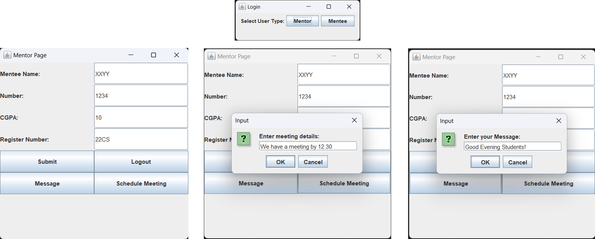
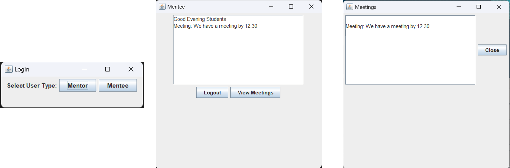

# Mentor-Mentee Management System

The **Mentor-Mentee Management System** is a Java-based desktop application designed to streamline the interaction and coordination between mentors and mentees. It provides a user-friendly graphical interface for managing mentee details, exchanging messages, and scheduling meetings.

---

## Features

### 1. Login and Role-Based Access
- Users can log in as either:
  - **Mentor**
  - **Mentee**
- Role-based access ensures that each user only interacts with relevant features.

### 2. Mentee Details Submission
- Mentees can submit their details, including:
  - Name
  - Contact Number
  - CGPA
  - Registration Number
- These details are stored locally in a text file (`mentee_details.txt`).

### 3. Message Exchange
- Mentors can send messages to mentees, which are saved in a file (`messages.txt`).
- Mentees can view the messages sent by mentors in their dashboard.

### 4. Meeting Scheduling
- Mentors can schedule meetings and store the details in a file (`meetings.txt`).
- Mentees can view scheduled meetings in their interface.

### 5. Logout Functionality
- Both mentors and mentees can securely log out of their session and return to the login screen.

---

## System Workflow

### 1. Login
- Users select their role (Mentor or Mentee) on the login screen.
- Role-specific dashboards are loaded based on the user's choice.

### 2. Mentor Dashboard
- Mentors can:
  - Submit and view mentee details.
  - Send messages to mentees.
  - Schedule meetings.
  - Logout securely.

### 3. Mentee Dashboard
- Mentees can:
  - View messages sent by mentors.
  - Access scheduled meetings.
  - Logout securely.

---

## File Storage
The system uses local text files to store data:
- `mentee_details.txt`: Stores mentee details.
- `messages.txt`: Stores mentor messages.
- `meetings.txt`: Stores meeting schedules.

---

## Technologies Used
- **Java**: Core programming language.
- **Swing**: For building the graphical user interface (GUI).
- **File I/O**: For saving and retrieving data in text files.

---

## How to Run
1. Compile the code using a Java IDE or `javac` command.
2. Run the application with `java MentorMenteeSystem`.
3. Interact with the application via the graphical interface:
   - Select your role (Mentor or Mentee) on the login screen.
   - Perform role-specific actions such as submitting details, scheduling meetings, or viewing messages.

---

## Future Enhancements
- Replace file-based storage with a robust database for better scalability and security.
- Add user authentication to ensure data privacy.
- Implement email or notification systems for better communication between mentors and mentees.

---

## Screenshots

### Mentor Page

### Mentee Page

---

## License
This project is open-source and available under the MIT License.
